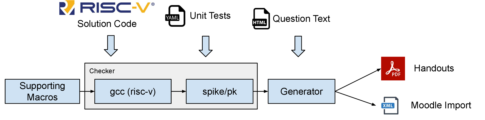

# RISC-V Programming Exercises Repository

Welcome to the RISC-V Programming Exercises Repository for Computer Architecture courses! This repository provides a collection of quizzes and programming exercises designed and utilized in the Computer Science bachelor's degree program at UNITO.

## Overview

Quizzes are standard Moodle questions written using LaTeX, while programming exercises rely on a couple of Python scripts to generate Moodle CodeRunner questions.

The programming exercises are structured using a pipeline illustrated in the diagram below. 

This system includes two main components:

### Checker

The Checker is a Python module that takes the following inputs:
1. A RISC-V source code containing the function to be tested and a test driver (the "main").
2. A source file with supporting macros.
3. A set of unit tests.

The Checker runs all unit tests on the code using the test driver and generates a report of the results in textual form. It can also be integrated into the Moodle CodeRunner backend (Jobe) to validate students' submissions.

### Generator

The Generator, another Python module, takes the same input files as the Checker, along with an additional HTML file containing the question text. It produces PDF handouts (using "pandoc") and the XML file to import the question into Moodle.

## Workflow

The process of preparing a question involves creating three input files:

1. **Question Text:** An ordinary HTML document that can contain various HTML tags, such as font formatting, links, and embedded images.

2. **Solution Code:** A RISC-V assembly program provided by the instructor. This program includes the function to be tested and a test driver (main). The source code must be annotated with special tags indicating the solution, test driver, and the position for inserting unit tests.

3. **Unit Tests:** Written in YAML and positioned at the end of the solution file. The Checker replaces the static test with the instructor-provided test cases. Each unit test contains code, expected output of the driver, and a display mode controlling feedback to students.

## Compiler and Simulator

We utilize a state-of-the-art compiler (GCC) for cross-compiling RISC-V code. The simulation environment involves Spike as a simulator, with RISC-V's Proxy Kernel (pk) to proxy system calls and execute programs in a Linux kernel over a different architecture.

## More information: 
-- Idilio Drago (idilio.drago@unito.it)
